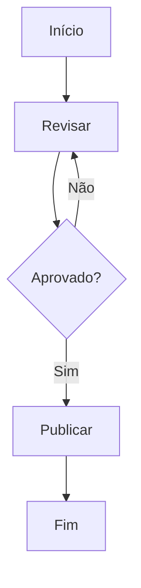

# Fase 1 — Data Model: Fatia S1 (Template Starter de Flowchart)

S1 **não estende o modelo de dados de S0**. O `GraphModel` de `src/core/model/types.ts` já carrega tudo o que
o starter precisa (`Node.shape`, `Edge.label`, `Edge.connector`, `direction`) — verificado contra o código
entregue. Este documento define as **três entidades novas de S1**, todas em `src/starter/`, todas puras.

## 1. Template Starter de Flowchart (`STARTER_MODEL`)

**O que é:** o conteúdo fixo de FR-002, expresso como **modelo de grafo canônico** — não como string Mermaid
(FR-003, Decisão L). Não é documento do usuário nem estado salvo: é o **valor inicial** do diagrama da
sessão, indistinguível de conteúdo colado assim que é apresentado (FR-004).

**Tipo:** `GraphModel` (de S0, **inalterado**). Congelado (`Object.freeze` profundo) — as mutações de S0 são
puras e nunca escrevem no modelo recebido, então o congelamento é uma rede de segurança, não um requisito.

```ts
// src/starter/model.ts
export const STARTER_MODEL: GraphModel = {
  direction: 'TD',
  nodes: [
    { id: 'inicio',   label: 'Início',    shape: 'rect',    subgraphId: null },
    { id: 'revisar',  label: 'Revisar',   shape: 'rect',    subgraphId: null },
    { id: 'aprovado', label: 'Aprovado?', shape: 'diamond', subgraphId: null },
    { id: 'publicar', label: 'Publicar',  shape: 'rect',    subgraphId: null },
    { id: 'fim',      label: 'Fim',       shape: 'rect',    subgraphId: null },
  ],
  edges: [
    { id: 'e0', source: 'inicio',   target: 'revisar',  connector: '-->', label: null  },
    { id: 'e1', source: 'revisar',  target: 'aprovado', connector: '-->', label: null  },
    { id: 'e2', source: 'aprovado', target: 'publicar', connector: '-->', label: 'Sim' },
    { id: 'e3', source: 'aprovado', target: 'revisar',  connector: '-->', label: 'Não' },
    { id: 'e4', source: 'publicar', target: 'fim',      connector: '-->', label: null  },
  ],
  subgraphs: [],
  preservedStyles: [],
}

export const STARTER_TEXT: string = generate(STARTER_MODEL)   // derivado, NUNCA escrito à mão
```

**Regras de validação (todas em tempo de teste — FR-015; nada em runtime, nenhum fallback):**

| Regra | Origem | Como é aferida |
|---|---|---|
| `node.id === deriveSlug(node.label)` para todo nó | FR-002 (ids pela regra de S0) | `tests/unit/starter-model.test.ts` contra `src/core/slug/` |
| ids únicos; edge ids seguem a convenção `e{índice}` de `nextEdgeId` | S0, `mutations.ts` | idem |
| toda `edge.source`/`edge.target` referencia um nó existente | FR-006a (nenhuma referência pendente) | idem |
| `STARTER_TEXT` é Flowchart **válido** | FR-015 | `importFlowchart(STARTER_TEXT).ok === true` |
| round-trip **sem perda de conteúdo estrutural**: `STARTER_MODEL → texto → modelo` preserva nós (id, rótulo, shape), arestas (origem, destino, conector, rótulo) e orientação | FR-015, S0 FR-007, Princípio II | comparação **order-insensitive**, com as duas normalizações abaixo |
| ≤ **6 nós** e ≤ **14 linhas** | FR-013, SC-009 | `STARTER_MODEL.nodes.length` e `STARTER_TEXT.split('\n')` |
| determinístico | Princípio IV | herdado de `generate` (G1), não re-aferido |

**Valor esperado de `STARTER_TEXT` (11 linhas, emissão linha-própria — FR-003a / G9):**



> Este bloco é **documentação**, não fonte. A fonte é `generate(STARTER_MODEL)`; o teste afirma a igualdade,
> de modo que uma divergência futura do gerador quebre a build em vez de passar despercebida.
> **Verificado** contra o gerador entregue: esta é a saída exata, em 11 linhas.

### ⚠ As duas normalizações do reimport (verificadas contra o código entregue)

O teste de round-trip de FR-015 MUST compará-las com tolerância. Um `expect(reimportado).toEqual(STARTER_MODEL)`
fica **vermelho sobre código correto** — e a "correção" tentadora quebraria FR-002 ou ST3:

| O que muda no reimport | Por quê | O que o teste deve fazer | O que **não** fazer |
|---|---|---|---|
| `direction: 'TD'` → **`'TB'`** | o Mermaid normaliza `TD`→`TB`; a ACL repassa. Mesma orientação (top-down); ambas são `Direction` válidas em S0 | tratar **`TD ≡ TB`** | trocar o starter para `TB` — o texto canônico de FR-002/SC-003 é `flowchart TD` |
| edge id `e0` → **`e0-inicio-revisar`** | a ACL deriva o id da aresta a partir de origem/destino; o modelo usa a convenção `nextEdgeId` de S0 | comparar arestas por **(origem, destino, conector, rótulo)**, **excluindo o id** | reescrever os ids do starter para o formato da ACL — o id de aresta é handle interno, e a convenção do modelo é a de `mutations.connect` |

Nenhuma das duas é **perda de conteúdo**: por isso nenhuma contradiz o Princípio II nem a garantia G8 do
gerador. O que o round-trip garante é **conteúdo estrutural**, e ele está integralmente preservado.

**Consequência de escopo (S0, não S1):** um modelo que veio do **parse** carrega `direction: 'TB'`, então uma
edição por canvas sobre ele gera `flowchart TB`. Isso é comportamento de S0 e **não é tocado por esta fatia**.
Não afeta SC-003: a primeira edição por canvas incide sobre o modelo **semeado** (`TD`), não sobre um
reimportado, então o cabeçalho não se mexe.

**Não-atributos (deliberados):** o modelo **não carrega coordenada** (Princípio V — o dagre calcula, o texto
nunca leva), **não carrega viewport** (Princípio VIII — o `fitView` de FR-013 é estado efêmero do React Flow)
e **não carrega marca de origem**. Não existe campo `isStarter`, `readonly` ou equivalente: FR-004 proíbe
qualquer marcação que distinga o starter de conteúdo colado. É o que faz dele um andaime e não um documento.

**Sobre `shape: 'diamond'` (FR-002a):** o `generate` de S0 o emite como `aprovado{Aprovado?}`, mas o `FlowNode`
de S0 desenha **todo** nó como retângulo (`shape` nem é passado de `CanvasPanel` a `FlowNode`). A divergência
é **aceita e explícita**: nesta release o formato é construto do **painel de código**, e a paridade canvas ↔
código afirmada por S1 cobre **nós, arestas e rótulos** — não formato.

## 2. Estado de primeiro contato (`SeedInput` / decisão de semeadura)

**O que é:** a condição de abertura em que a sessão não tem nada a restaurar. É a **única** condição que
dispara a semeadura.

```ts
// src/starter/seed.ts
/** Conteúdo de sessão anterior que o buffer do RN-06 poderia devolver. Nesta
 *  fatia existe SÓ como entrada da decisão: nenhum produtor real é construído
 *  aqui (FR-011). O tipo é opaco de propósito — a decisão só olha presença. */
export type RestorableDraft = { readonly text: string }

export interface SeedInput {
  restorableDraft: RestorableDraft | null
}

/** Função PURA (FR-011a): a regra de precedência de FR-011 vive aqui, e não no
 *  caminho de inicialização, para ser exercitável por unidade (SC-008). */
export function shouldSeedStarter(input: SeedInput): boolean {
  return input.restorableDraft === null
}
```

**Regra de precedência (FR-011, SC-008):** **qualquer** conteúdo restaurável vence o starter e o suprime por
completo — **inclusive um rascunho que represente um canvas vazio**. A mera existência de conteúdo restaurável
caracteriza um usuário retornando. O starter **nunca** é mesclado ao rascunho nem escrito por cima dele.

**Transição de estado (uma só, por sessão):**

```
      bootstrap
          │
          ├── shouldSeedStarter({restorableDraft: null}) = true ──► SEMEADO ──► (conteúdo comum da sessão)
          │                                                            │
          │                                                    limpar │ colar por cima
          │                                                            ▼
          └── restorableDraft ≠ null ─────────────────────────────► NÃO SEMEADO ◄── (terminal na sessão)
                (fatia RN-06 futura;                                   ▲
                 nesta fatia, só em teste)                             └── nada re-semeia (FR-008)
```

**FR-008 (uma vez por sessão) não é um campo de estado:** é uma propriedade do **local** da chamada — o
bootstrap roda uma vez por carregamento de página (Decisão G). Não há flag `hasSeeded` a persistir nem
marcador de sessão a consultar; é o que mantém FR-010/ADR-003 verdadeiros (`sessionStorageLength === 0`
segue afirmado por `ephemeral.spec.ts`).

## 3. Estado vazio alvo da limpeza

**O que é:** o estado **integral** de abertura da aplicação — o valor com que o store de S0 nasce (Decisão G
o preserva exatamente para isto). Não é "o modelo vazio": inclui o **estado só-de-UI** (FR-006a).

| Campo do store (S0) | Valor alvo | Por quê |
|---|---|---|
| `model` | `createEmptyModel()` | FR-006 |
| `lastValidModel` | `createEmptyModel()` | senão a próxima edição por canvas mutaria o starter morto (S0, FR-004) |
| `editorText` | `''` | FR-006; também zera o predicado de FR-007 para a próxima limpeza |
| `status` | `'ok'` | canvas e texto vazios **sem erro** (FR-006) |
| `connectMode` | `false` | FR-006a |
| `connectSourceId` | `null` | FR-006a — **ponteiro pendurado**: `mutations.connect` não valida ids; o gerador emitiria uma aresta sem definição de origem, que o Mermaid materializa como **nó implícito**, ressuscitando um nó do starter (FR-008/SC-006) |
| `announcement` | (não zerado) | a limpeza **escreve** o anúncio de conclusão (FR-017b) |
| *debounce do parse* | **cancelado** | FR-006b — trabalho em voo (ver abaixo) |
| `editingNodeId` / `editDraft` (`CanvasPanel`, `useState` local) | **derivado**, não comandado | FR-006c — não vive no store; some quando o nó em edição sai de `model.nodes` (Decisão K) |

**Invariante que unifica os três últimos:** *nenhum ponteiro para conteúdo — parado, agendado ou local —
sobrevive à destruição do conteúdo que ele referencia.*

**Trabalho em voo (FR-006b):** o timer de `setEditorText` captura o texto **por closure** e `applyParsedText`
escreve `model`/`lastValidModel` **sem escrever `editorText`**. Um parse armado antes da limpeza devolveria o
conteúdo antigo ao canvas em t=80 ms deixando o código vazio ao lado — starter ressuscitado **e** os dois
lados dessincronizados. Daí `clearSession()` chamar `cancelPendingParse()` **antes** do `setState`.

## Entidades explicitamente ausentes

- **Documento, sessão salva, marcador de "já semeou"** — FR-010/ADR-003: a sessão é efêmera e o texto Mermaid
  é a única saída copiável.
- **Catálogo/lista/seletor de templates** — FR-012: Flowchart é o único tipo desta release e o starter é
  único. A escolha entre templates pertence a fatias posteriores.
- **Buffer de recuperação (RN-06)** — FR-011: apenas sua **entrada** existe (`SeedInput`), sempre `null` na
  execução real e preenchida só nos testes que exercitam a precedência.
- **Marca de origem no modelo** (`isStarter`, `readonly`, …) — FR-004: o starter é conteúdo comum assim que
  apresentado.
